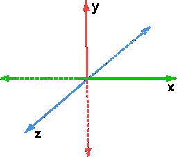

# 7. Coordinate systems and basis vectors

So far, we have treated a vector as three numbers `(x, y, z)`. But these numbers are meaningful only relative to a **coordinate system**.

A three-dimensional coordinate system has:

- an origin `(0, 0, 0)`;
- an X axis;
- a Y axis;
- a Z axis.

In the coordinate system used here, positive X points to the right, positive Y points upward, and positive Z points toward the viewer. In the flat illustration, the Z axis is drawn diagonally.



Every vector is defined relative to this coordinate system. For example, the coordinates `(2, 3, 4)` mean that the vector consists of:

- two units along the X axis;
- three units along the Y axis;
- four units along the Z axis.

## Basis vectors

The axis directions can themselves be represented by vectors. These are called **basis vectors**.

The positive directions of the axes in our coordinate system are represented by:

```text
X = (1, 0, 0)
Y = (0, 1, 0)
Z = (0, 0, 1)
```

They have length `1`, are mutually perpendicular, and together form the standard basis. In this basis, each basis vector coincides with one coordinate-system axis.

For now, assume that the origins of all coordinate systems coincide. We therefore care only about the directions of their axes; we will return to displaced origins later.

A vector's coordinates tell us how many copies of each basis vector to use:

```text
(2, 3, 4) = 2X + 3Y + 4Z
```

## From rows to columns

Vectors are often printed horizontally as rows. Transposing each representation produces column vectors:

```text
    [1]       [0]       [0]
X = [0]   Y = [1]   Z = [0]
    [0]       [0]       [1]
```

Placing them side by side stores the basis in columns:

```text
        X  Y  Z
      [ 1  0  0 ]
basis [ 0  1  0 ]
      [ 0  0  1 ]
```

The standard basis produces a symmetric identity table, so the effect of transposition is not visually apparent. It will become clearer with a rotated basis.

## Task

Implement `createVectorFromBasis(x, y, z)` using `multiplyScalar()` and `add()`. Do not construct the final `Vector3` directly from `x`, `y`, and `z`.

Run the exercise tests:

```bash
npm test -- exercises/07-basis-vectors
```

## Visualization

Run the demo to see the standard coordinate system and its three unit basis vectors:

```bash
npm run demo -- exercises/07-basis-vectors
```

The red arrow shows `X = (1, 0, 0)`, the green arrow shows `Y = (0, 1, 0)`, and the blue arrow shows `Z = (0, 0, 1)`.
